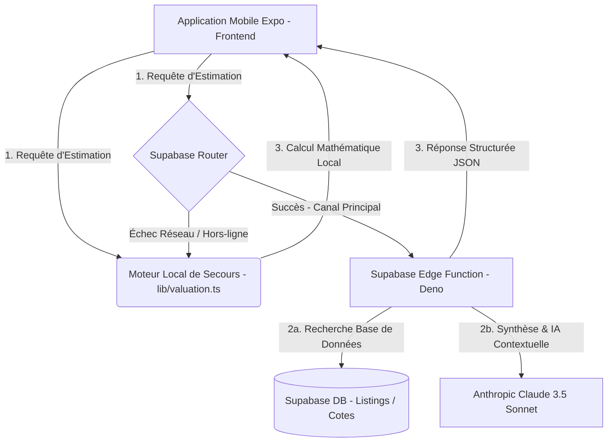

# 💎 Architecture Technique & Algorithmique — Qimatna DZ

Ce document détaille l'architecture système globale, le flux de données et l'algorithme mathématique d'estimation de **Qimatna DZ**. Ce moteur a été conçu pour reproduire fidèlement l'expertise d'un courtier automobile algérien chevronné en combinant le Big Data en temps réel avec des règles physiques rigoureuses.

---

## 🏛️ 1. Architecture Globale du Système

L'application repose sur une architecture full-stack hybride conçue pour une tolérance maximale aux pannes (offline fallback), une vitesse d'exécution optimale et une intelligence artificielle avancée.

### Les Composants Clés :
1.  **Le Frontend (React Native & Expo)** :
    *   Interface utilisateur premium, fluide et animée (`app/result.tsx`).
    *   Gestion locale du pipeline de données et sauvegarde hybride double (`localStorage` + synchronisation cloud).
2.  **Le Moteur Local (`lib/valuation.ts`)** :
    *   Contient l'intégralité de l'algorithme mathématique d'estimation et du classificateur de segments.
    *   Sert de **fallback instantané** si le réseau est inaccessible ou si le serveur rencontre un problème.
3.  **La Edge Function Cloud (`supabase/functions/calculate-valuation`)** :
    *   Code Deno ultra-rapide hébergé sur le serveur mondial de Supabase.
    *   Interroge la base de cotes réelles et enrichit les données grâce à l'API Claude d'Anthropic pour une analyse contextuelle avancée.
4.  **La Base de Données (Supabase)** :
    *   `listings` : Annonces scannées quotidiennement sur le marché algérien.
    *   `prix_medians` : Cotes historiques consolidées par année et modèle.
    *   `vehicle_catalog` : Métadonnées structurelles des véhicules (type de carrosserie, dimensions).

---

## ⚙️ 2. L'Algorithme de Classification Systématique à 9 Segments

Pour éviter d'avoir à déclarer manuellement chaque nouveau véhicule qui arrive sur le marché (notamment l'afflux des marques chinoises et des modèles d'importation), le système intègre un **Classificateur de Segments Automatique**.

Dès que la marque et le modèle sont saisis, l'algorithme inspecte les chaînes de caractères et les métadonnées pour attribuer l'un des **9 segments de cotes de référence** :

| Segment | Exemples Typiques | Valeur de Référence (2018 Usé en 2026) |
| :--- | :--- | :--- |
| **`citadine_budget`** | Suzuki Alto, Chery QQ, Hyundai i10 (Base)... | **1 250 000 DZD** (125M) |
| **`citadine_standard`** | Renault Clio, Seat Ibiza, Peugeot 208, Swift... | **2 200 000 DZD** (220M) |
| **`citadine_premium`** | Audi A1, Mini Cooper, Mercedes Classe A... | **2 850 000 DZD** (285M) |
| **`berline_standard`** | Renault Symbol, Dacia Logan, Peugeot 301, Accent... | **2 450 000 DZD** (245M) |
| **`berline_premium`** | Audi A4, BMW Série 3, Mercedes Classe C, Octavia... | **5 400 000 DZD** (540M) |
| **`crossover_compact`** | **Kia KX1**, Geely Coolray, Sandero Stepway, Captur... | **2 650 000 DZD** (265M) |
| **`suv_routier`** | Hyundai Tucson, Kia Sportage, VW Tiguan... | **4 200 000 DZD** (420M) |
| **`suv_prestige`** | Porsche Cayenne, Range Rover, Mercedes Classe G... | **11 500 000 DZD** (1,15 Md) |
| **`utilitaire_pickup`** | Toyota Hilux, Peugeot Partner, VW Caddy... | **3 200 000 DZD** (320M) |

---

## 📈 3. La Formule Mathématique d'Estimation en 4 Phases

Dès que le segment de base est identifié ou que la fiche du véhicule est récupérée dans le catalogue, l'algorithme déroule la formule suivante :

### Phase 1 : Ajustement Temporel (L'âge et l'inflation)
Contrairement aux marchés européens où les voitures subissent une décote brutale, le marché algérien maintient des cotes extrêmement élevées en raison de la rareté et de la dévaluation monétaire.
*   **Futur (Années > 2018) :** Valorisation douce de **`+5%` par an** (ex: *une Symbol 2022 d'occasion conserve une valeur très haute*).
*   **Passé (Années < 2018) :** Dépréciation plate de seulement **`-4%` par an** (ex: *une Symbol 2012 garde encore une valeur de ~120 millions centimes*).

$$\text{Prix Ajusté Année} = \text{Base} \times (1.05)^{\Delta t_{\text{futur}}} \quad \text{ou} \quad \text{Base} \times (1.04)^{\Delta t_{\text{passé}}}$$

### Phase 2 : Ajustement de Marque (L'image de marque)
Le prix ajusté subit un coefficient multiplicateur selon la catégorie de la marque saisie :
*   **Prestige** (`Porsche`, `Range Rover`) $\rightarrow$ **`x1.25`**
*   **Premium** (`Mercedes`, `BMW`, `Audi`) $\rightarrow$ **`x1.12`**
*   **Budget** (`Dacia`, `Suzuki`, `Chery`, `Geely`) $\rightarrow$ **`x0.82`**
*   **Généraliste** (`Kia`, `Hyundai`, `Renault`, `Toyota`) $\rightarrow$ **`x1.00`**

### Phase 3 : Ajustement Physique Individuel (L'état réel)
Le système applique alors des bonus et malus selon les saisies exactes de l'utilisateur :
1.  **Kilométrage (L'usure) :**
    *   **00 Compteur / Quasi-Neuf ($\le 100$ km)** : Application automatique du coefficient **`Sans Décote`** pour simuler le prix d'importation vierge.
    *   **Kilométrage Standard** : Calcul de la dérive kilométrique par rapport à la moyenne nationale (20 000 km/an). Chaque tranche de sur-roulage applique une décote exponentielle de `-3%`.
2.  **Carrosserie & Sbigha (Le critère roi en Algérie) :**
    *   *Peinture d'origine (Sans Sbigha)* : **`Bonus de +5%`** sur le prix final !
    *   *Retouches / Raccords* : Aucun impact (`0%`).
    *   *Repeinte (Voile)* : Décote de **`-6%` à `-10%`**.
    *   *Choc réparé* : Décote sévère de **`-15%` à `-20%`**.
3.  **Mécanique & Moteur :**
    *   *Comme neuf* : **`Bonus de +5%`**.
    *   *Fatigué / À réviser* : Décote de **`-15%`**.
4.  **Carburant GPL :**
    *   Injection d'un bonus forfaitaire de **`+200 000 DZD`** pour valoriser l'installation.

---

## 🛡️ 4. Formule de l'« Évaluation Globale » physique

Pour que le score affiché sur 100 ne soit plus arbitraire ou fictif, le système calcule désormais la moyenne pondérée exacte des caractéristiques physiques du véhicule :

| Critère Physique | Poids dans la Note | Règle de Calcul |
| :--- | :--- | :--- |
| **Kilométrage** | **35%** | Débute à 100/100, perd `1 point` tous les `3 500 km` roulés (minimum de 10). |
| **État Général** | **25%** | Excellent (`100/100`), Bon (`80/100`), Moyen (`50/100`), Mauvais (`20/100`). |
| **Carrosserie & Paint** | **20%** | Origine (`100/100`), Raccord/Retouche (`80/100`), Repeinte (`50/100`), Choc (`15/100`). |
| **Mécanique** | **20%** | Neuf (`100/100`), Bon (`80/100`), Fatigué (`30/100`). |

$$\text{Note Finale} = (\text{Score Km} \times 0.35) + (\text{Score État} \times 0.25) + (\text{Score Paint} \times 0.20) + (\text{Score Moteur} \times 0.20)$$

---

## 📈 5. Calcul des Fourchettes de Prix (Sécurité du Marché)

*   **Prix Conseillé** : La médiane exacte après application de tous les critères.
*   **Fourchette Basse** : Représente la valeur plancher pour une vente rapide (10ème centile de marché), calibrée pour protéger le vendeur.
*   **Fourchette Haute** : Représente la valeur idéale espérée pour une transaction patiente auprès d'un particulier.
*   **Safety Floor** : Aucune voiture en état de marche ne peut être estimée sous la barre des **200 000 DZD**, garantissant la cohérence même pour les véhicules très anciens (années 1990-2000).

---

💎 **Grâce à cette alliance unique entre Big Data scanné et logique mathématique à 9 segments ajustée aux spécificités locales, Qimatna DZ fournit aujourd'hui l'estimation automobile la plus intelligente, fiable et précise du marché algérien !**